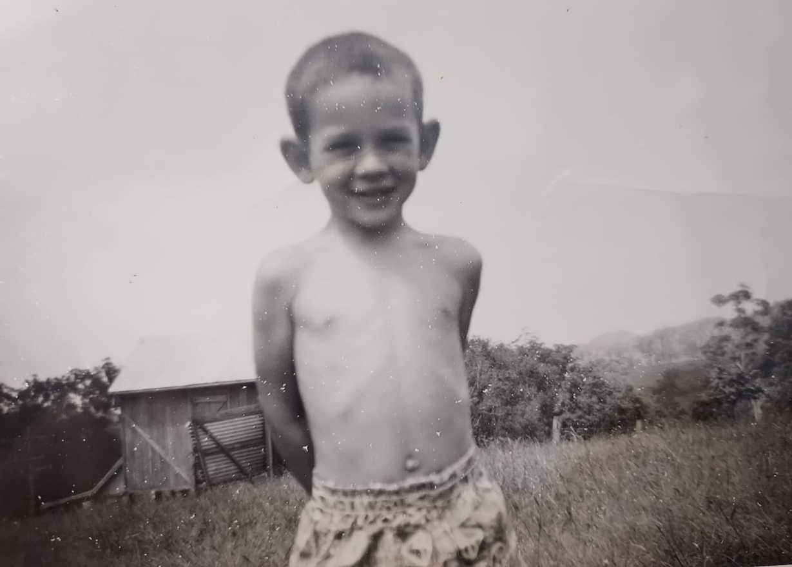

---
output:
  html_document:
    css: styles.css
---

<h1>Alex Laverty Family History Book</h1>

My grandparents Leonard James Laverty and Elsie Pearl McGree lived on a farm in Taylors Arm and had 11 children, 6 boys and 5 girls.

The farm was a dairy farm and dad would have to get up early to milk the cows.

This is what the house on the farm looks like today

Dad said that when he was a kid he would walk to school without any shoes and occassionaly they'd go out and shoot parrots for dinner.

<b>Gerry Laverty</a>

They sold the farm around INSERT_YEAR and these days it has been subdivided into 3 seperate plots.

This is an aerial photo of the farm from google maps

<b>2343 Taylors Arm Rd</b>

The Laverty farm is down the road from the famous "Pub With No Beer",

The history of The Pub With No Beer dates back to 1943, when farmer Dan Sheahan went to the Day Dawn Hotel in Ingham, north of Queensland, only to find American soldiers had drunk the pub dry of beer.

With a glass of wine in hand instead, he penned the poem "A Pub Without Beer".

Country singer Gordon Parsons adapted the song to "A Pub With No Beer", basing it on his own local at Taylors Arm, then called the Cosmopolitan Hotel.

When his friend Slim Dusty recorded the song in 1957, it became an Australian chart-topper.

<b>Slim Dusty</b>

In Taylors Arm is also the Laverty's Bridge.

<b>Pictured, Andrea Laverty, Gerry Laverty</b>

Which according to the Taylors Arm Community facebook group occassionaly floods and goes under water.

<b>Lavertys Bridge flooded, 14 February 2020</b>

# Laverty Family Reunion 1989

There were a few family who went off to world war II.

## World War II

<b>Peter James McGree and his sister Ellen</b>

## Peter James McGree

Macksville Railway Station early 1920. Jim (James) Gaddes ready to unload a cart of broom millet brought from Taylors Arm and grown by Albert Cordell on Jim Wards property later to be owned by Tom Mulvhill. Pictured are left to right Jim Gaddes, Peter McGree and Albert Cordell.

# Koch's

## The Cooks of Stuarts Point

This history begins in 1853 on May 3rd when Peter Koch (Cook) arrived in Australia on the ship "Droden" from Germany with his wife Anna Catherine (Schroder). He was 25 years old and he and Anna brought with them a baby son Franz (Frank) who was born on 20 Th September 1852 in Wallstadt, Germany. Both of Peter's parents, George and Elizabeth were deceased as was Anna's father Jaco but her mother, Catharina was still alive

The date of the Cook's arrival at Stuart's Point is not yet precisely known They would have traveled up the coast by sailing vessel or steamer either to the Macleay or to Port Macquarie and thence onto the Macleay. An application to establish a Public School at Yarr happini in 1880 bears the signature of Peter Cook as being on a committee of seven residents seeking education for their children. At that time Peter and Anna had 12 children but only the last five were young enough to attend school. In March of 1883 the school opened with 21 students enrolled. The first teacher was James Harvey who was 21 and who had no formal training as a teacher but would have spent some weeks in a large school learning the system

In 1883 the Kirkwood brothers opened a sawmill at Stuart's Point and a village soon started to grow around the mill Stuart's Point got it's own Public School in 1899 and this y t would have seen many of the descendants of Peter and Anna attending. The first teacher, Henry Peck from Wagga Wagga was not impressed with conditions at the Point.

"I have an inferior residence one and a quarter miles from school. That distance I have to trudge knee-deep in sand in all weathers I am 26 miles from store, church, doctor etc. and no steamer or coach to reach Kempsey Sometimes my family are without beef for a fortnight, and when supplied it is hardly fit for human consumption Further it is not con venient to keep a borse as there is no grass within miles of the Point. This is the home of Death Adders snakes and sandflies, also the dingo, but few people"

This gives a little insight to conditions at Stuart's Point in the 19th century. Although another sawmill opened in 1886, the work was intermittent and the families were poor, Peter is known to have been a farmer, lay Methodist Minister and a Vine Dresser. It is not known if he worked at the mill He was best known as caretaker of the North Coast Co's shed and wharf at Stuart's Point He was naturalized on 27/Aug/1878 Anna was a midwife at Stuart's Point

Peter died in 1909 and his death is recorded in an article from a local newspaper at the time which states he was a very old colo nist It continues "Peter Cook who died at his residence at Stuart's Point on Friday night last week. The deceased gentleman was well-known not only in the Maclery District, but also the Nambucca and Bellinger. He succumbed to heart failure following kidney disease and his death was rather sadden No one in the vicinity of Stuart's Point was more highly respected than "Grandfather Cook" as he was affectionately termed by both young and old. A Native of Germany the late Mr. Cook was 84 years of age, but he was in all respects except in regard to place of birth an Australian, as he had resided in NSW for nearly 60 years and was intintensely proud of his adopted land. Deceased was

John Peter Cook Death Certificate

# Immigration to Australia

Michael Laverty and Sarah Jane Laverty (McCormick) came to Australia in 1865 on the ship named St Hilda, they arrived on the thirtieth day of January 1865

|Surname|Firstname|Age|
|---|---|---|
|Laverty|Michael|30|
|   |Sarah|28|
|   |Dennis|5|
|   |Catherine|3|
|   |Sarah|1|

# Obituaries

## Denis Michael Laverty - Died 26th August, 1961

Obituary

Mr Denis Laverty.

Monday of last week Mr. Denis Laverty JP, a well-known Taylor's Arm resident, passed away very suddeling owing to heart failure. Deceased aged 61 years, was born in England, but came to Australia with his parents when five years old. The famiy settled at Pola Creek, deceased leaving there some 37 years ago to take up land on Taylor's Arm, where he had since resided. His wife (formerly Miss Goldspring) and a family of seven sons and four daughters survive him; as also does his 88-year-old mother. The funeral under conduct of Mr. J. T. Walker, took place to Bowraville cemetery Wednesday last, the Rev. Father Goodman officiating at the grace-side. The late Mr. Laverty was widely respected, and much sympathy is extended his bereaved family.

OF YOUR CHARITY PRAY FOR THE REPOSE OF THE SOUL OF

Denis Laverty

who died on

26th August, 1961.

"Eternal rest grant unto him, O Lord, and let perpetual light shine upon him. May he rest in peace. Amen." 300 Days Indulgence.

"O Sacred Heart of Jesus, I put all my trust in Thee."

300 Days' Indulgence

E. J. DWYER

# List of Graves

## Peter James McGree

## Alfred Henry Cook and Jessie Elvina Cook (Coulter)

## Ethel Stella Cook (McGree)

## Leonard James Laverty and Elsie Pearl Laverty (McGree)

## Michael Laverty and Sarah Jane Laverty (McCormick)

## James McGree and  Bridget McGree (Sullivan)

