---
output:
  html_document:
    css: styles.css
title: Alex Laverty Family History Book

---

# Table of Contents

<!-- TOC -->

- [Table of Contents](#table-of-contents)
- [Introduction](#introduction)
- [Alex Laverty Ancestry.com DNA Ethnicity Estimate](#alex-laverty-ancestrycom-dna-ethnicity-estimate)
    - [Ethnicity Estimate](#ethnicity-estimate)
    - [Detailed Comparison of](#detailed-comparison-of)
    - [Ancestors Family Tree](#ancestors-family-tree)
- [Laverty Farm in Taylors Arm](#laverty-farm-in-taylors-arm)
- [The Pub with No Beer](#the-pub-with-no-beer)
- [Lavertys Bridge](#lavertys-bridge)
    - [Big is beautiful for family](#big-is-beautiful-for-family)
- [Laverty Family Reunions](#laverty-family-reunions)
    - [Laverty Family Reunion 1989](#laverty-family-reunion-1989)
        - [Laverty's came in their hundreds](#lavertys-came-in-their-hundreds)
        - [Lavert Reunion Starts Tomorrow](#lavert-reunion-starts-tomorrow)
        - [Laverty re-union](#laverty-re-union)
        - [Laverty reunion](#laverty-reunion)
    - [Laverty Reunion 2015](#laverty-reunion-2015)
    - [Leonard and Elsie Lavertys Children and Partners](#leonard-and-elsie-lavertys-children-and-partners)
    - [Leonard and Elsie Lavertys Grand Children](#leonard-and-elsie-lavertys-grand-children)
- [World War II](#world-war-ii)
    - [The McGree Brothers](#the-mcgree-brothers)
        - [War Time Mystery Leads Two Men to Taylors Arm](#war-time-mystery-leads-two-men-to-taylors-arm)
        - [Planning Begins for McGree Photo Presentation](#planning-begins-for-mcgree-photo-presentation)
        - [McGree Family Truly Upheld ANZAC Spirit](#mcgree-family-truly-upheld-anzac-spirit)
    - [Leonard James Laverty](#leonard-james-laverty)
        - [Leonard James Laverty enlistment form](#leonard-james-laverty-enlistment-form)
- [The McGree Family](#the-mcgree-family)
    - [Peter James McGree](#peter-james-mcgree)
- [The Koch Family](#the-koch-family)
    - [German Ancestry](#german-ancestry)
    - [The Cooks of Stuarts Point](#the-cooks-of-stuarts-point)
- [Immigration to Australia](#immigration-to-australia)
    - [Laverty Immigration](#laverty-immigration)
    - [Koch Immigration](#koch-immigration)
- [Births](#births)
- [Marriages](#marriages)
    - [Len and Wendy Laverty 1974](#len-and-wendy-laverty-1974)
- [Deaths](#deaths)
    - [Elsie Pearl Laverty McGree Eulogy](#elsie-pearl-laverty-mcgree-eulogy)
    - [Leonard James Laverty](#leonard-james-laverty)
    - [Denis Michael Laverty - Died 26th August, 1961](#denis-michael-laverty---died-26th-august-1961)
- [List of Graves](#list-of-graves)
    - [Leonard James Laverty and Elsie Pearl Laverty nee McGree](#leonard-james-laverty-and-elsie-pearl-laverty-nee-mcgree)
    - [Denis Laverty 1920 and Nora Laverty nee Goldspring 1944](#denis-laverty-1920-and-nora-laverty-nee-goldspring-1944)
    - [Peter James McGree](#peter-james-mcgree)
    - [Ethel Stella Cook McGree](#ethel-stella-cook-mcgree)
    - [James & Bridget McGree nee Sullivan](#james--bridget-mcgree-nee-sullivan)
    - [Alfred Henry Cook and Jessie Elvina Cook nee Coulter](#alfred-henry-cook-and-jessie-elvina-cook-nee-coulter)
    - [Michael Laverty and Sarah Jane Laverty nee McCormick](#michael-laverty-and-sarah-jane-laverty-nee-mccormick)

<!-- /TOC -->

# Introduction

This is my attempt at putting together a history of my family, with so much information it's hard to figure out how to structure it and in what order, so I will start with myself and work my way up, the information will mainly focus around the descendants and ancenstors of my paternal grand parents, Leonard James Laverty and Elsie Pearl McGree.

# Alex Laverty Ancestry.com DNA Ethnicity Estimate

## Ethnicity Estimate

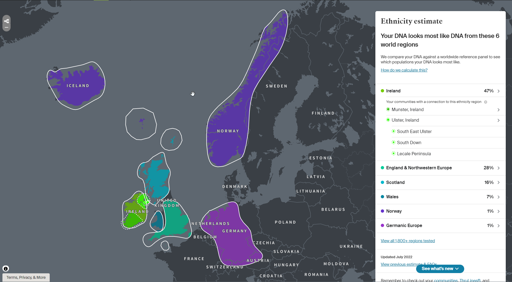

## Ethnicity Estimate by Parent

This chart shows the percentages of each ethnicity you inherited from your parents.

Added together, the percents from each parent for a region equals your percent for that region.

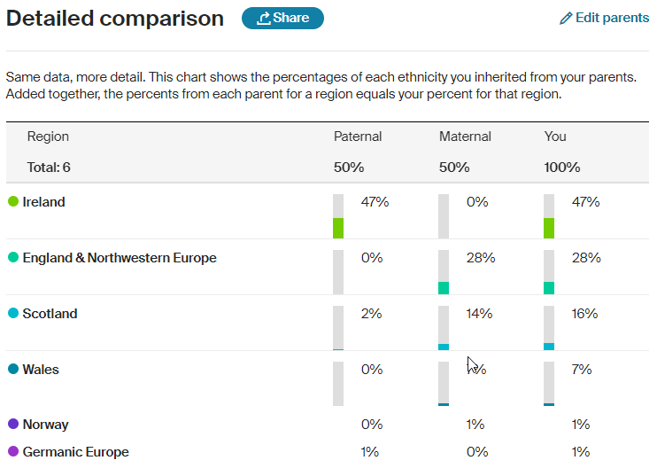

## Ancestors Family Tree

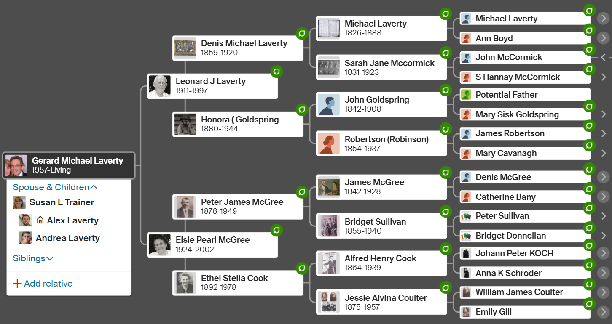

# Laverty Farm in Taylors Arm

My grandparents Leonard James Laverty and Elsie Pearl McGree lived on a farm in Taylors Arm and had 11 children, 6 boys and 5 girls.

The farm was a dairy farm and dad would have to get up early to milk the cows.

This is what the house on the farm looks like today

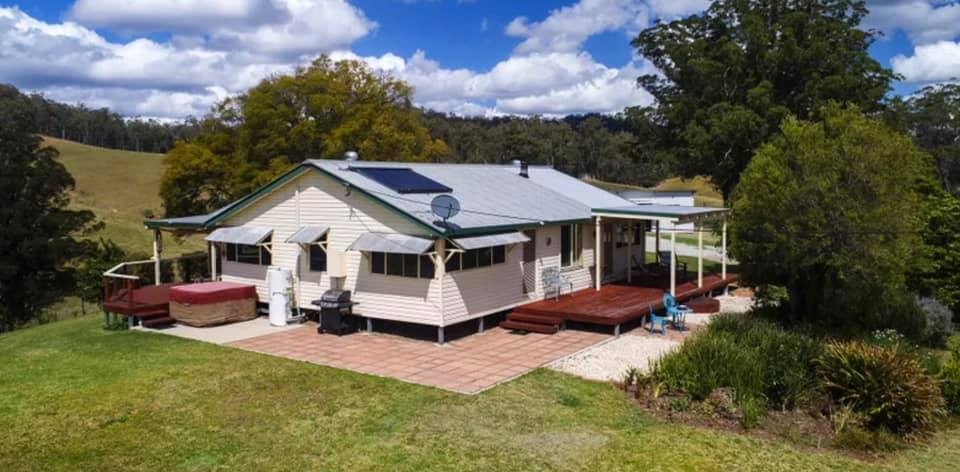

They sold the farm around INSERT_YEAR and these days it has been subdivided into 3 seperate plots.

This is an aerial photo of the farm from google maps

<b>2343 Taylors Arm Rd</b>

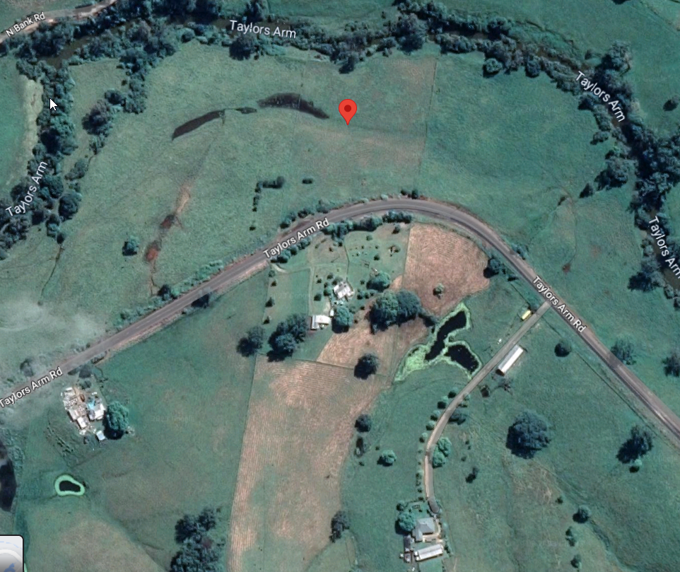

# The Pub with No Beer

The Laverty farm is down the road from the famous "Pub With No Beer",

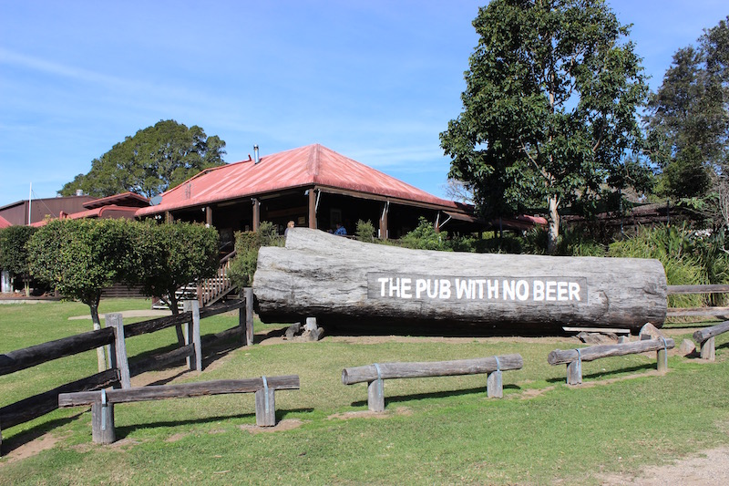

The history of The Pub With No Beer dates back to 1943, when farmer Dan Sheahan went to the Day Dawn Hotel in Ingham, north of Queensland, only to find American soldiers had drunk the pub dry of beer.

With a glass of wine in hand instead, he penned the poem "A Pub Without Beer".

Country singer Gordon Parsons adapted the song to "A Pub With No Beer", basing it on his own local at Taylors Arm, then called the Cosmopolitan Hotel.

When his friend Slim Dusty recorded the song in 1957, it became an Australian chart-topper.

<b>Slim Dusty</b>
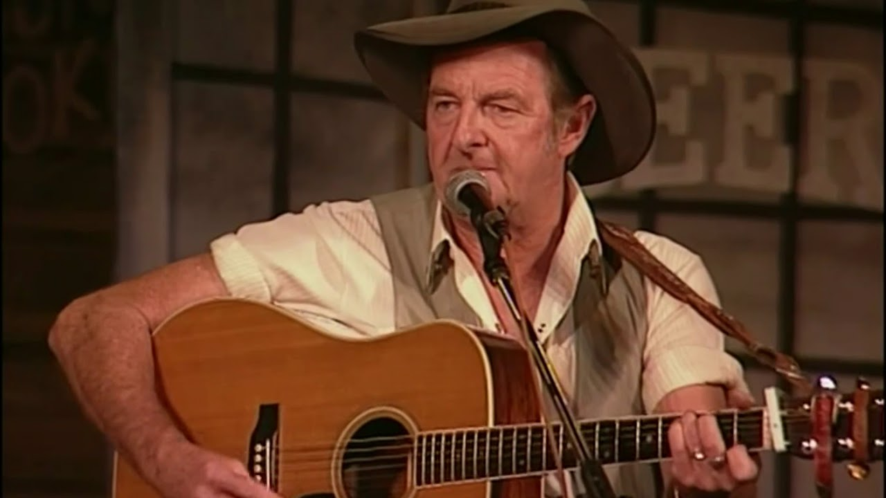

# Lavertys Bridge

In Taylors Arm is also the Laverty's Bridge.

<b>Pictured, Andrea Laverty, Gerry Laverty</b>

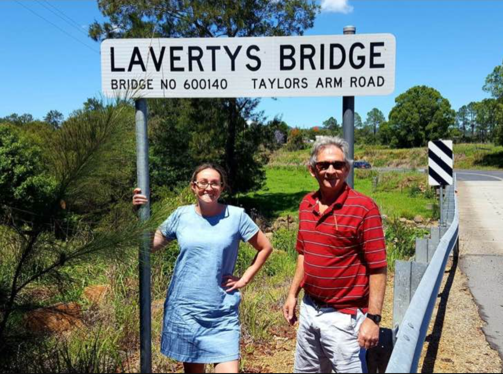

Which according to the Taylors Arm Community facebook group occassionaly floods and goes under water.

<b>Lavertys Bridge flooded, 14 February 2020</b>

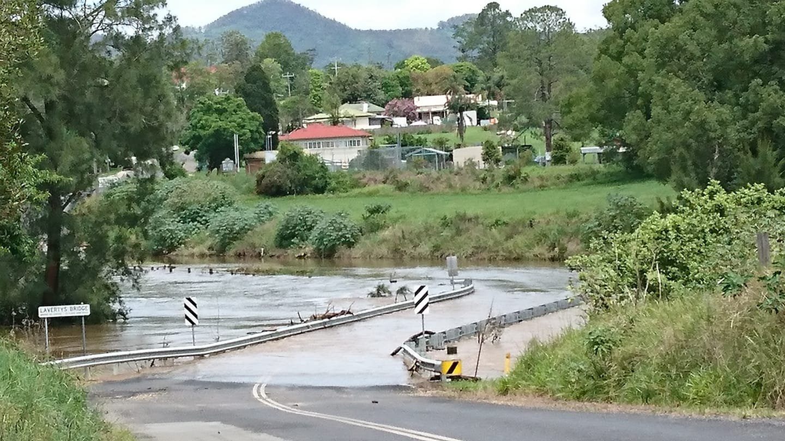

## Big is beautiful for family

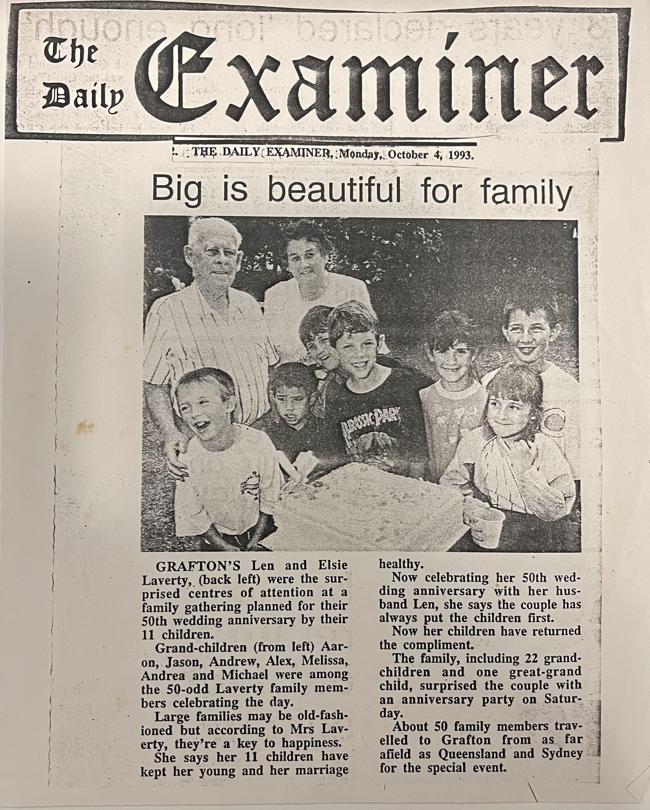

Daily Examiner

THE DAILY EXAMINER, Monday, October 4, 1993.

Big is beautiful for family

GRAFTON'S Len and Elsie Laverty, (back left) were the surprised centres of attention at a family gathering planned for their 50th wedding anniversary by their 11 children.

Grand-children (from left) Aaron, Jason, Andrew, Alex, Melissa, Andrea and Michael were among the 50-odd Laverty family members celebrating the day. Large families may be old-fash ioned but according to Mrs Laverty, they're a key to happiness. She says her 11 children have kept her young and her marriage healthy.

Now celebrating her 50th wed ding anniversary with her husband Len, she says the couple has always put the children first. Now her children have returned the compliment.

The family, including 22 grand children and one great-grand child, surprised the couple with an anniversary party on Saturday.

About 50 family members travelled to Grafton from as far afield as Queensland and Sydney for the special event.

# Laverty Family Reunions

The Laverty families have occassionaly held family reunion gatherings. I have been to two such reunions, one in Macksville Showground 1989 when I was about 4 years old, and a more recent one in at Grafton on 4th April 2015.

## Laverty Family Reunion 1989

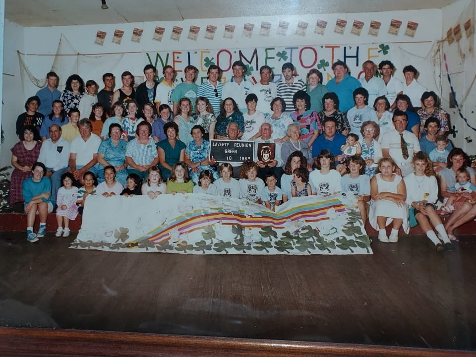

### Laverty's came in their hundreds

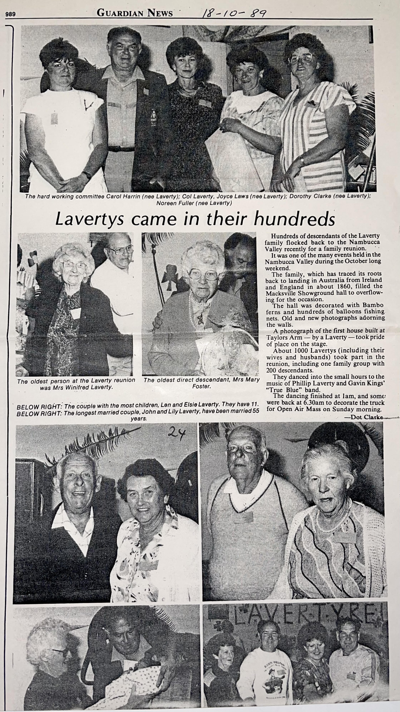

Hundreds of descendants of the Laverty

family flocked back to the Nambucca Valley recently for a family reunion. It was one of the many events held in the Nambucca Valley during the October long

weekend.

The family, which has traced its roots back to landing in Australia from Ireland and England in about 1860, filled the Macksville Showground hall to overflow ing for the occasion.

The hall was decorated with Bambo ferns and hundreds of balloons fishing. nets. Old and new photographs adorning the walls. A photograph of the first house built at

Taylors Arm- by a Laverty-took pride of place on the stage. About 1000 Lavertys (including their wives and husbands) took part in the reunion, including one family group with 200 descendants.

They danced into the small hours to the music of Phillip Laverty and Gavin Kings' "True Blue" band.

The dancing finished at lam, and some were back at 6.30am to decorate the truck for Open Air Mass on Sunday morning.

-Dot Clarke

### Lavert Reunion Starts Tomorrow

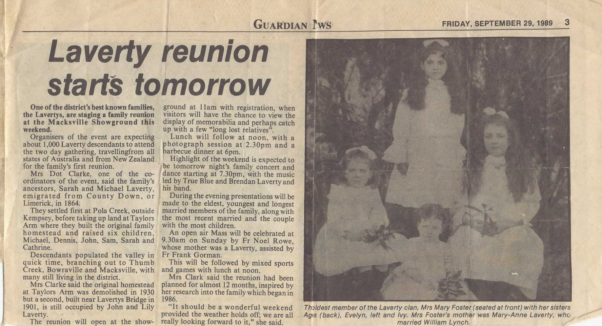

One of the district's best known families, the Lavertys, are staging a family reunion at the Macksville Showground this

weekend. Organisers of the event are expecting about 1,000 Laverty descendants to attend the two day gathering, travellingfrom all states of Australia and from New Zealand

for the family's first reunion. Mrs Dot Clarke, one of the co- ordinators of the event, said the family's ancestors, Sarah and Michael Laverty, emigrated from County Down, or Limerick, in 1864.

They settled first at Pola Creek, outside Kempsey, before taking up land at Taylors Arm where they built the original family homestead and raised six children, An open air Mass will be celebrated at Michael, Dennis, John, Sam, Sarah and

Cathrine. Descendants populated the valley in quick time, branching out to Thumb Creek, Bowraville and Macksville, with many still living in the district.

Mrs Clarke said the original homestead planned for almost 12 months, inspired by at Taylors Arm was demolished in 1930 but a second, built near Lavertys Bridge in 1901, is still occupied by John and Lily Laverty.

ground at Ilam with registration, when visitors will have the chance to view the display of memorabilia and perhaps catch up with a few "long lost relatives".

Lunch will follow at noon, with a photograph session at 2.30pm and a barbecue dinner at 6pm.

Highlight of the weekend is expected to be tomorrow night's family concert and dance starting at 7.30pm, with the music led by True Blue and Brendan Laverty and his band.

During the evening presentations will be made to the eldest, youngest and longest married members of the family, along with the most recent married and the couple with the most children.

9.30am on Sunday by Fr Noel Rowe, whose mother was a Laverty, assisted by Fr Frank Gorman. This will be followed by mixed sports and games with lunch at noon.

Mrs Clark said the reunion had been

her research into the family which began in 1986. "It should be a wonderful weekend provided the weather holds off; we are all The reunion will open at the show- really looking forward to it," she said.

### Laverty re-union

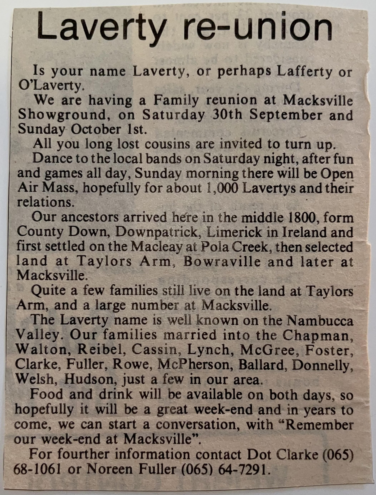

Is your name Laverty, or perhaps Lafferty or O'Laverty.

We are having a Family reunion at Macksville Showground, on Saturday 30th September and Sunday October 1st.

All you long lost cousins are invited to turn up. Dance to the local bands on Saturday night, after fun and games all day, Sunday morning there will be Open Air Mass, hopefully for about 1,000 Lavertys and their relations.

Our ancestors arrived here in the middle 1800, form Down, Downpatrick, Limerick in Ireland and first settled on the Macleay at Pola Creek, then selected land at Taylors Arm, Bowraville and later at

Macksville. Quite a few families still live on the land at Taylors Arm, and a large number at Macksville.

The Laverty name is well known on the Nambucca Valley. Our families married into the Chapman, Walton, Reibel, Cassin, Lynch, McGree, Foster, Clarke, Fuller, Rowe, McPherson, Ballard, Donnelly, Welsh, Hudson, just a few in our area.

Food and drink will be available on both days, so hopefully it will be a great week-end and in years to come, we can start a conversation, with "Remember our week-end at Macksville".

For fourther information contact Dot Clarke (065) 68-1061 or Noreen Fuller (065) 64-7291.

### Laverty reunion

The Laverty family whose obstinacy gave the area the separation of Upper and Lower Taylors Arm holds a reunion on Saturday and Sunday. Many of the family are still in the Macleay-Nambucca regions.

Others will travel from South Australia, Victoria and Queensland, and even from New Zealand for the reunion, to be held at the Macksville Showground.

An open air mass is planned at 9am on Sunday. The Laverty family, with a rather complicated family tree, has as its crest Fortune Favours the Brave but it is not known exactly why labourer, Michael Laverty fled Ballymyhinch, County Down, for England half way through last century.

Unusually for his time, he could read and write, and at Chiltern Moor, Cumberland, met and then married at Workington another Catholic, Sarah McCormick.

They and three children were assisted migrants when the St Hilda arrived at Port Jackson on February 4, 1865. A brother in law, Auguste Raymonde, was then living at Pola Creek.

Family records say they settled at Pola Creek, then (?) near Kinchela, but because of flooding moved to an area to become known as Laverty's Plains near Taylors Arm in 1884. A son, Dennis Laverty, born at Chiltern and five when they shipped for the colony, and his bride, Nora Goldspring, were to be the first couple married in the old Catholic Church on Wards Farm, the amorous suitor riding 80 miles (129km) to Orara near Coffs Harbour to do his courting. He selected his homestead, Oakvale, in 1883 and built his home in 1902.

Around the same time a John Laverty (Snr) selected land near the present Taylors Arm Hall. Sam Laverty, a son by a previous marriage of the immigrant Michael, had subsequently followed his father to Australia and selected across the river. When a milk factory was planned a site on Sam's farm was selected - but he refused to sell and the factory was moved to a site farther upstream to bring the separation of today's

Upper and Lower Taylor's Arm.

Adding further piquancy to the family tree,

Dennis Laverty's Nora was the daughter of an Elizabeth Donnelly (nee Robertson or Ribinson) who had married a John Goldspring - after first being married to a Michael Donnelly, producing two sons. She left her husband because of his drinking and following his death married Goldspring (an Irish builder and the son of a herring fisherman) who had travelled the world and a number of goldfields.

Family sources say the family was well off, but were forced to leave Ireland when "the i English confiscated their property, arriving in NSW via the USA.

A family book and other memorabilia will be on sale at the reunion.

Col Laverty

Roy Sanders Street, South West Rocks

## Laverty Reunion 2015

## Leonard and Elsie Lavertys Children and Partners

Lyndon, Colin, Linda, Joan, Pam, Peter, Susan, Gerry, Mary, Tom, Lilly, Danny, Elsie, Irene, Greg, Ilene, Len, Wendy.

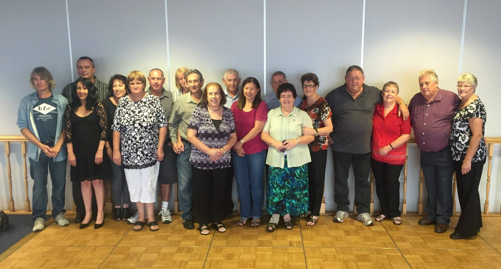

## Leonard and Elsie Lavertys Grand Children

Back Row : Luke, Brooke, Andrew, Aaron, Alex, Melissa, Michael, 1, 1, Ashleigh

Front Row : Jason, 1, Denis, Sharon, 1, Andrea, Carol, Lenice

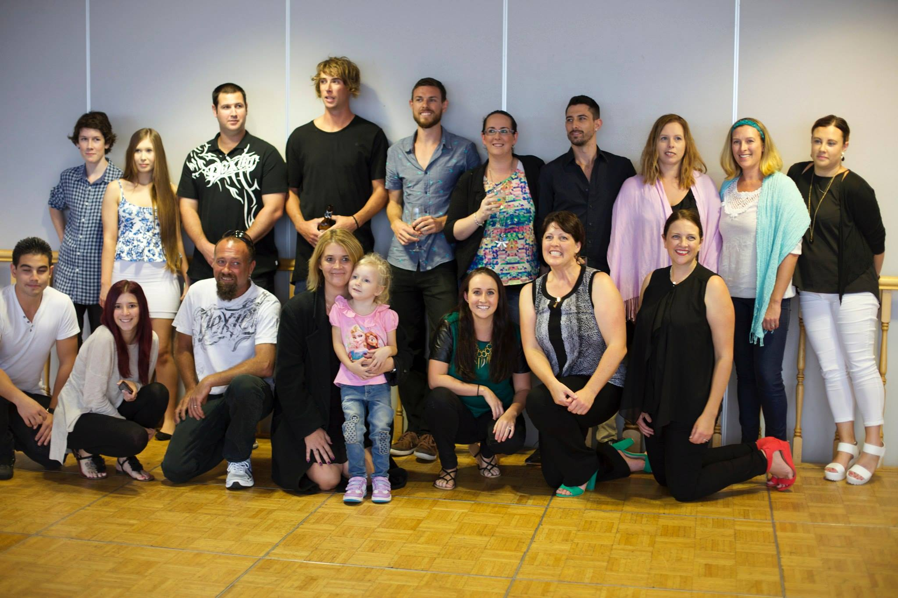

# World War II

## The McGree Brothers

### War Time Mystery Leads Two Men to Taylors Arm

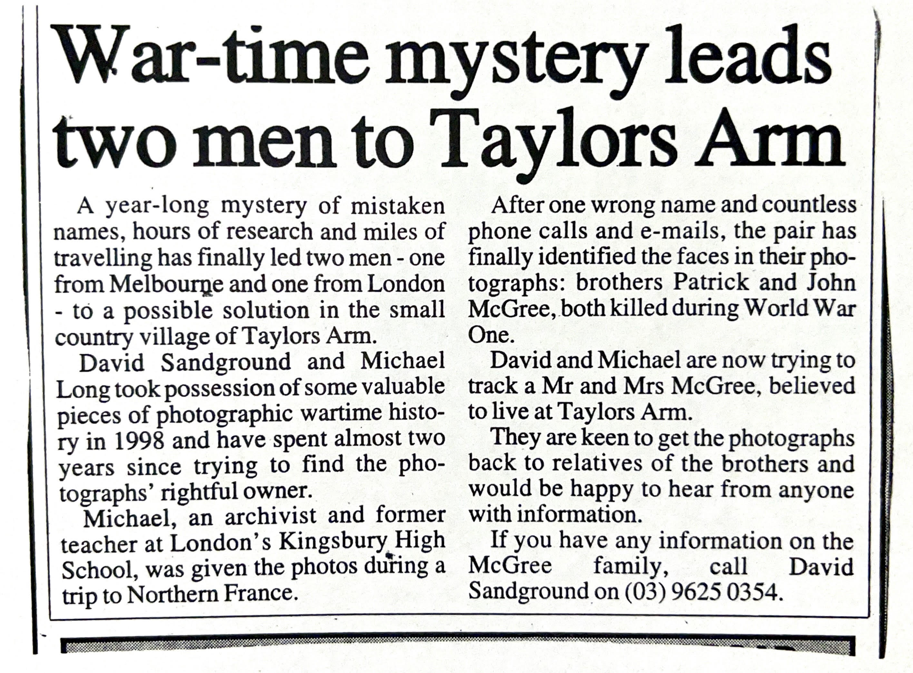

Official Presentation Brings Search to an End
Regular readers of the Mid-Coast Observer may remember a number of articles on two photographs taken during World War One of brothers Patrick and John McGree.

The search for identity of the brothers led two men - Michael Long from England and Melbourne's David Sandground - on a world-wide search, eventually ending in the small farming village of Taylors Arm.

Two stories were run in this paper, asking anyone who knew the identity of the young men to come forward. And it worked.

The two men received numerous calls from people who were related to, or knew of the McGree boys. Taylors Arm Sub-Branch members also offered their assistance.

And on October 3, the photographs will take their rightful place during an official presentation to be held at noon.

Taylors Arm Sub-Branch members are now completing arrangements for Mr Sandground to hand over these unique pieces of wartime history to members of the McGree family.

The presentation will coincide with another special event in Taylors Arm history - the unveiling and dedication of a plaque to those who gave their lives to our country.

All relatives, friends and interested people are invited to attend this histor ical event. Organisers expect a large attendance of neighbouring sub branch members to witness the occa sion.

### Planning Begins for McGree Photo Presentation

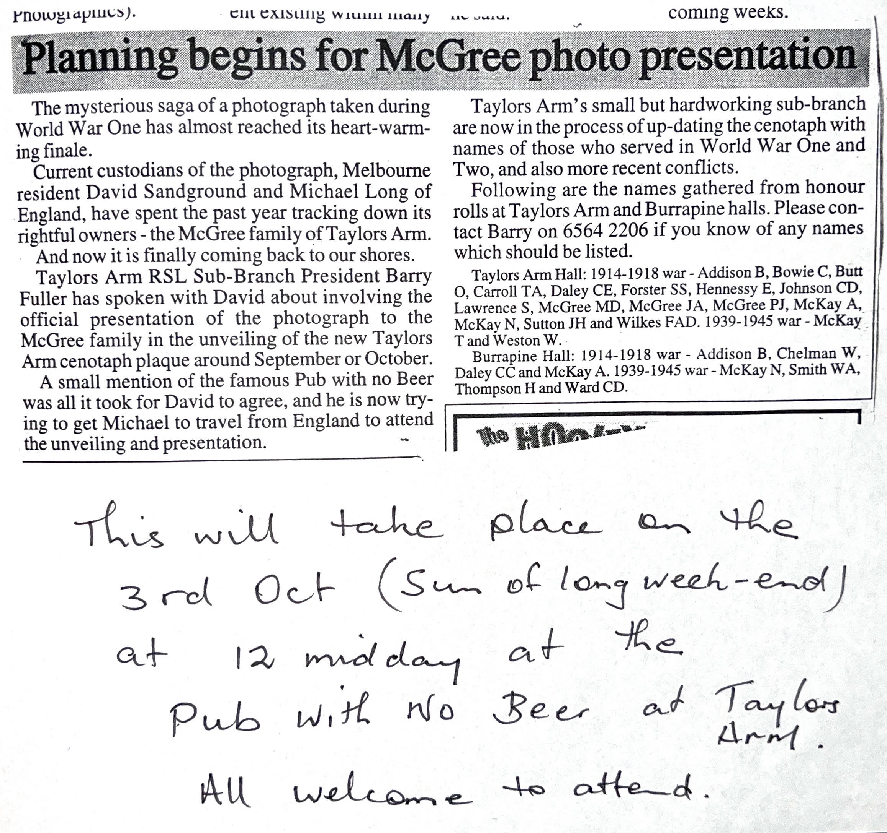

Planning begins for McGree photo presentation

The mysterious saga of a photograph taken during World War One has almost reached its heart-warming finale.

Current custodians of the photograph, Melbourne resident David Sandground and Michael Long of England, have spent the past year tracking down its rightful owners - the McGree family of Taylors Arm. And now it is finally coming back to our shores.

Taylors Arm RSL Sub-Branch President Barry Fuller has spoken with David about involving the official presentation of the photograph to the McGree family in the unveiling of the new Taylors Arm cenotaph plaque around September or October.

A small mention of the famous Pub with no Beer was all it took for David to agree, and he is now try ing to get Michael to travel from England to attend the unveiling and presentation.

Taylors Arm's small but hardworking sub-branch are now in the process of up-dating the cenotaph with names of those who served in World War One and Two, and also more recent conflicts.

Following are the names gathered from honour rolls at Taylors Arm and Burrapine halls. Please con tact Barry on 6564 2206 if you know of any names which should be listed.

Taylors Arm Hall: 1914-1918 war - Addison B, Bowie C, Butt O, Carroll TA, Daley CE, Forster SS, Hennessy E, Johnson CD, Lawrence S, McGree MD, McGree JA, McGree PJ, McKay A, McKay N, Sutton JH and Wilkes FAD. 1939-1945 war - McKay T and Weston W.

Burrapine Hall: 1914-1918 war-Addison B, Chelman W, Daley CC and McKay A. 1939-1945 war - McKay N, Smith WA, Thompson H and Ward CD.

<b>Patrick James McGree</b>

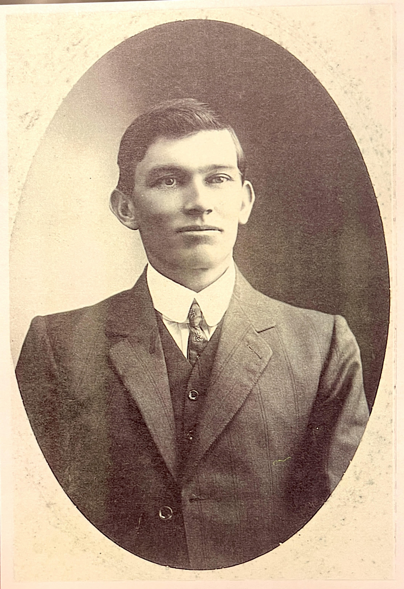

<b>Peter James McGree</b>

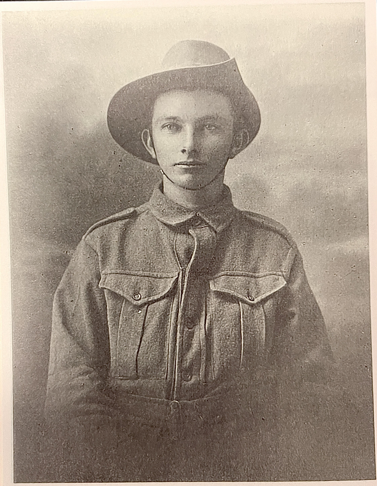

<b>Peter James McGree and his sister Ellen</b>

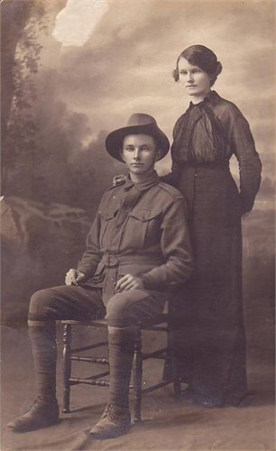

### McGree Family Truly Upheld ANZAC Spirit

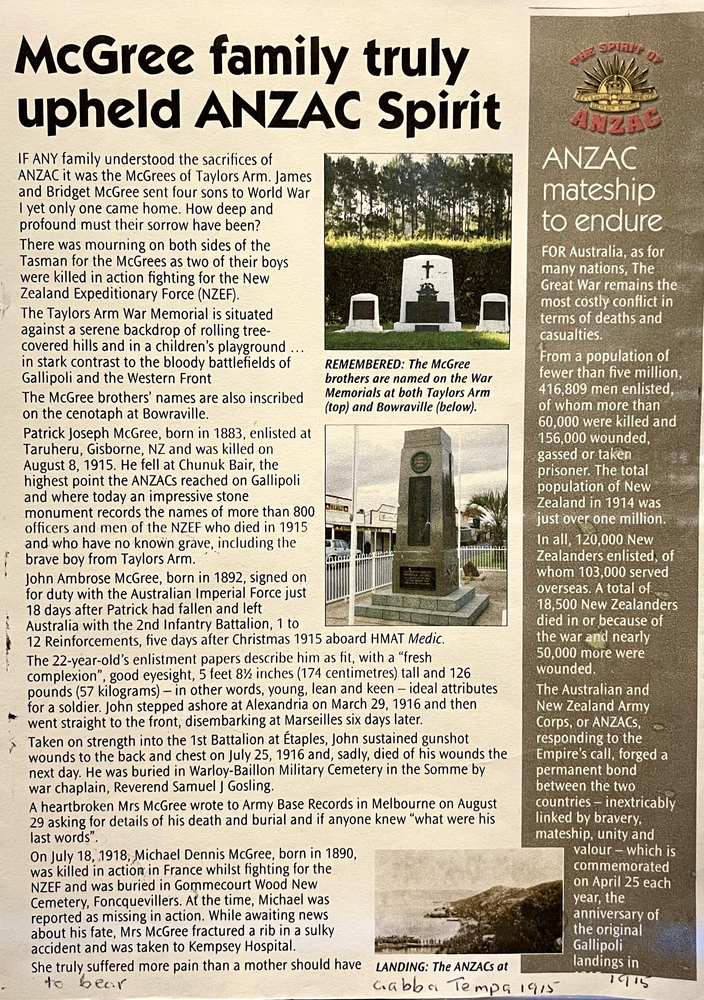

McGree family truly upheld ANZAC Spirit

If ANY family understood the sacrifices of ANZAC was the McGrees of Taylors Arm. James and Bridget McGree sent four sons to World War I yet only one came home. How deep and profound must their sorrow have been? There was mourning on both sides of the Tasman for the McGrees as two of their boys were killed action fighting for the New Zealand Expeditionary Force (NZEF).

The Taylors Arm War Memorial situated against serene backdrop of rolling tree covered hills and in children's playground.... stark contrast to bloody battlefields of Gallipoli and Western Front.

The McGree brothers' names are also on cenotaph Bowraville. Patrick Joseph McGree, born 1883, enlisted at Taruheru, Gisborne, and was killed August 8, 1915. He fell Chunuk Bair, the highest point ANZACS reached Gallipoli and where today impressive stone monument records names more than 800 officers men of NZEF who died 1915 and who have known grave, including the brave boy from Taylors Arm.

John Ambrose McGree, born 1892, signed on for duty with Australian Imperial Force just 18 days after Patrick had fallen and left Australia with the Infantry Battalion, 1 Reinforcements, five days after Christmas 1915 aboard HMAT Medic.

The 22-year-old's enlistment papers describe him as fit with "fresh. complexion", good eyesight, 5 feet inches (174 centimetres) tall and 126 pounds (57 kilograms)-in other words, young, lean and keen-ideal attributes for soldier. John stepped ashore Alexandria on March 29, 1916 and then went straight to the front, disembarking Marseilles six days later. Taken on strength into the Battalion at Étaples, John sustained gunshot wounds to the back chest on July 25,1916 and, sadly, died of his wounds the next day. He was buried Warloy-Baillon Military Cemetery in the Somme by war chaplain, Reverend Samuel J Gosling. A heartbroken Mrs McGree wrote to Army Base Records in Melbourne on August 29 asking for details of his death and burial and if anyone knew "what were his last words".

On July 18, 1918, Michael Dennis McGree, born 1890, was killed in action in France whilst fighting for the NZEF and buried in Gommecourt Wood New Cemetery, Foncquevillers. At the time, Michael was reported as missing action. While awaiting news about his fate, McGree fractured a rib in a sulky accident and was taken to Kempsey Hospital. She suffered more pain than mother should bear.

REMEMBERED: The McGree brothers are named on the War Memorials at both Taylors Arm. (top) and Bowraville (below). inscribed

LANDING: The ANZACs at Gabba Tempa 1915

## Leonard James Laverty

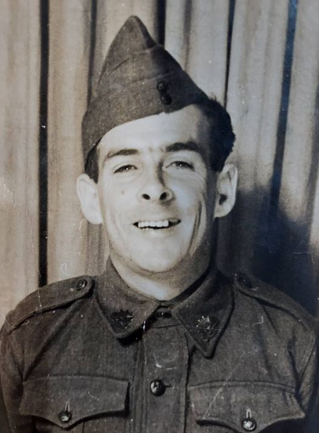

<b>Leonard James Laverty and his sister Jenevieve Laverty</b>

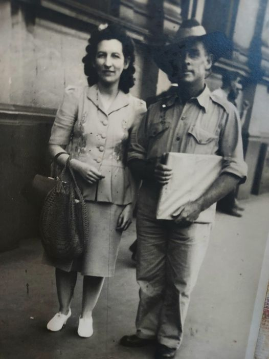

### Leonard James Laverty enlistment form

source - https://recordsearch.naa.gov.au/

Contents date range - 1939 - 1948

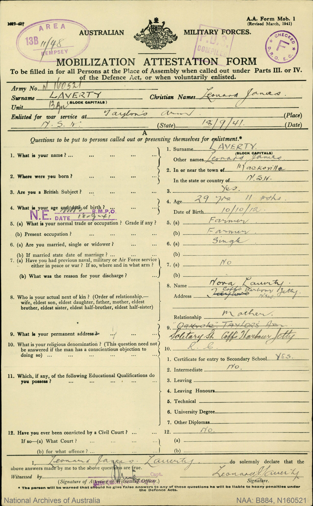

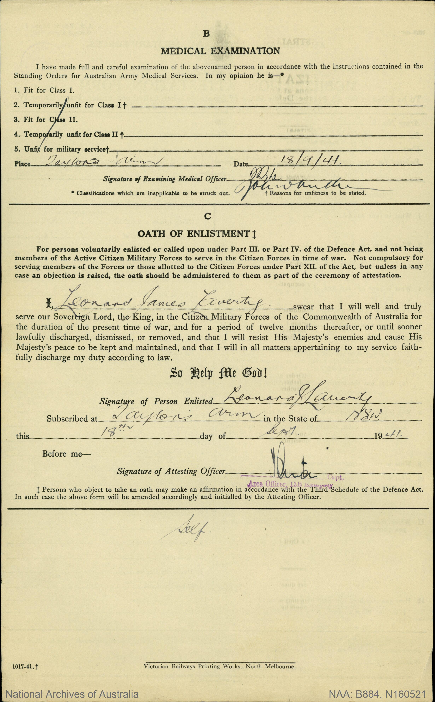

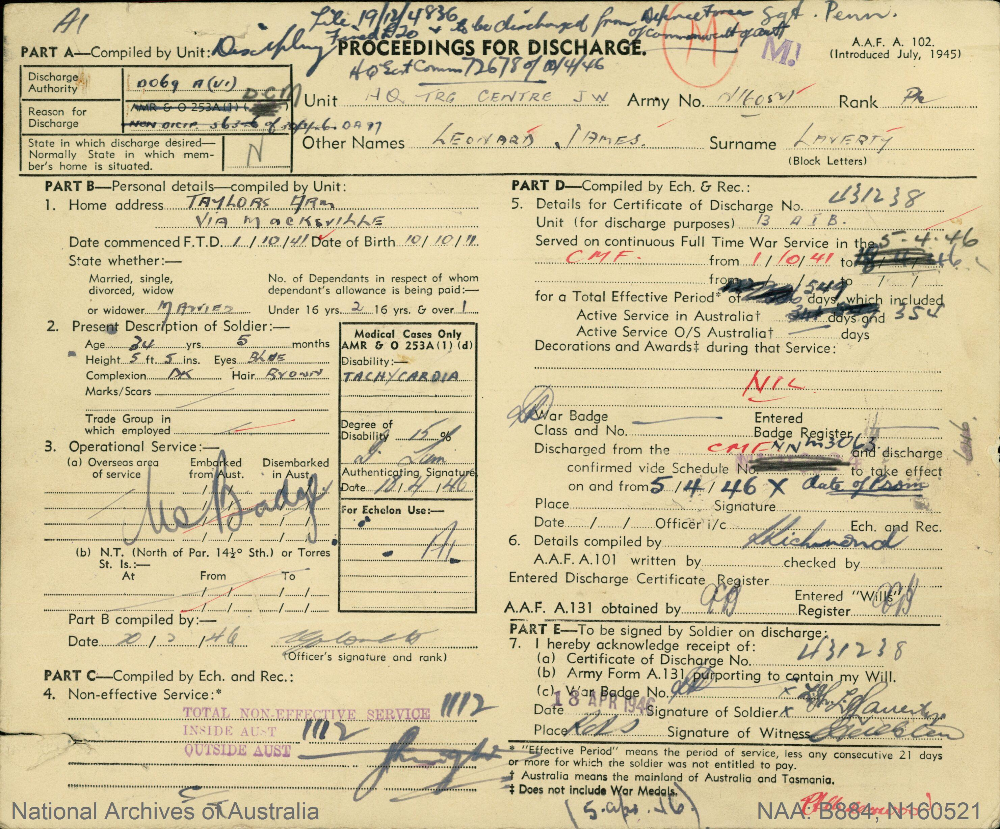

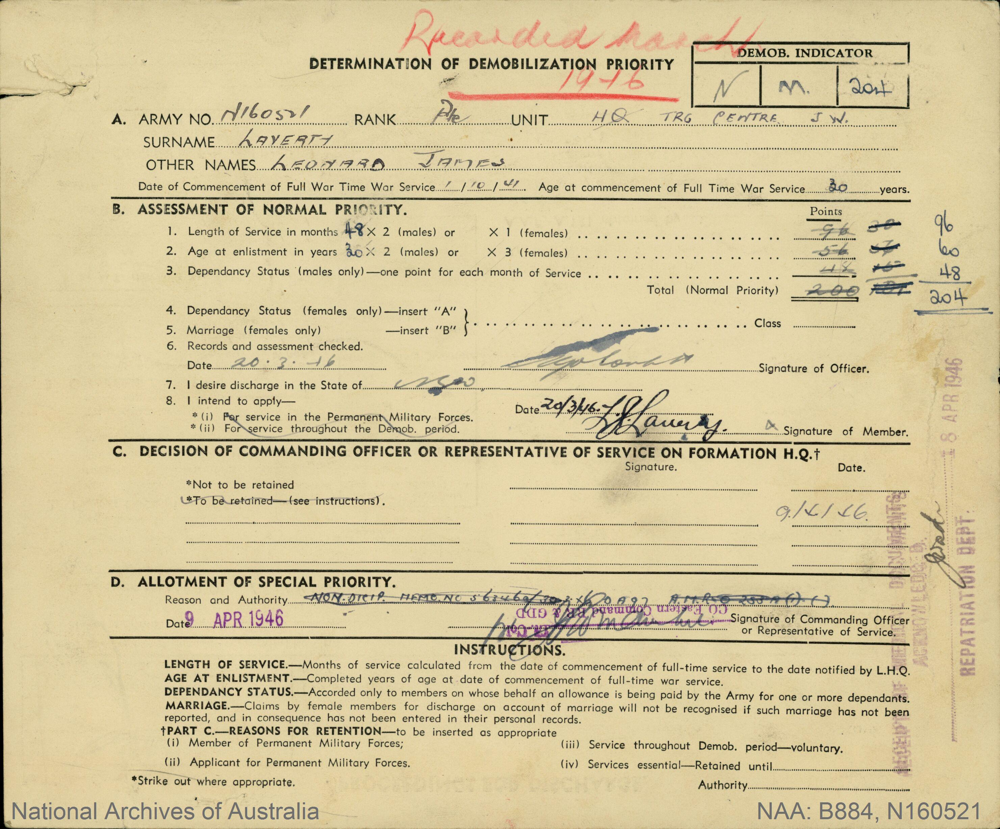

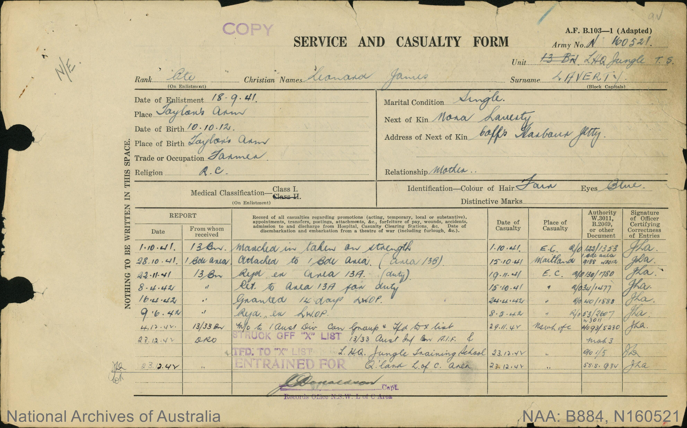

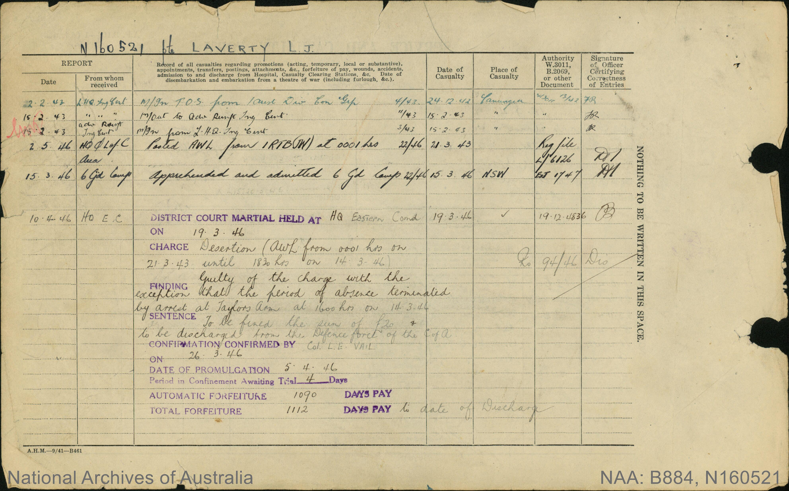

# The McGree Family

## Peter James McGree

Macksville Railway Station early 1920. Jim (James) Gaddes ready to unload a cart of broom millet brought from Taylors Arm and grown by Albert Cordell on Jim Wards property later to be owned by Tom Mulvhill.

Pictured are left to right Jim Gaddes, Peter McGree and Albert Cordell.

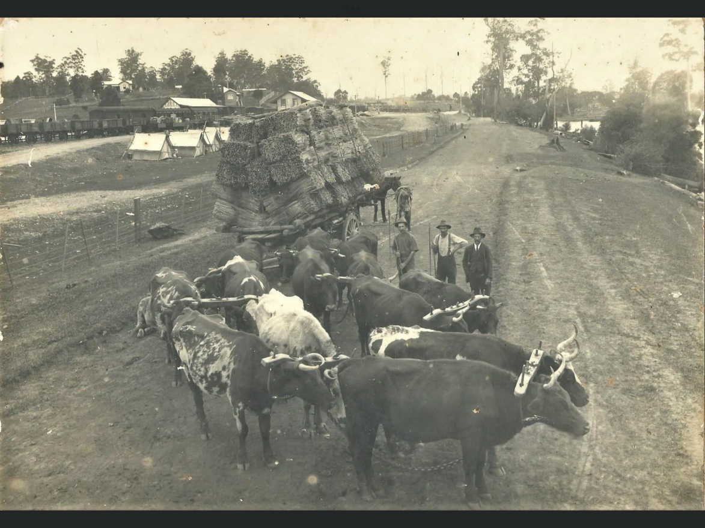

# The Koch Family

## German Ancestry

One thing I found interesting was that my grand mother Elsie had german ancestry via the following path way :

Elsie Pearl McGree --> Ethel Stella Cook --> Alfred Henry Cook --> Johan Peter Koch

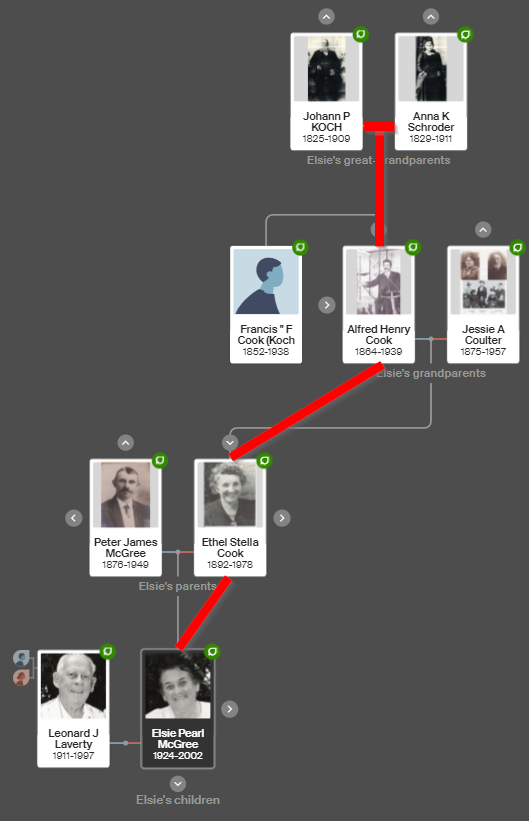

## The Cooks of Stuarts Point

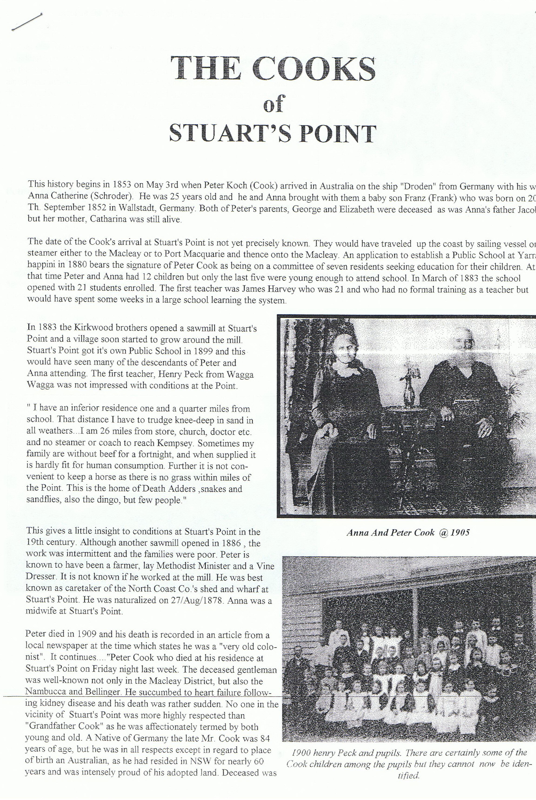

This history begins in 1853 on May 3rd when Peter Koch (Cook) arrived in Australia on the ship "Droden" from Germany with his wife Anna Catherine (Schroder). He was 25 years old and he and Anna brought with them a baby son Franz (Frank) who was born on 20 Th September 1852 in Wallstadt, Germany. Both of Peter's parents, George and Elizabeth were deceased as was Anna's father Jaco but her mother, Catharina was still alive

The date of the Cook's arrival at Stuart's Point is not yet precisely known They would have traveled up the coast by sailing vessel or steamer either to the Macleay or to Port Macquarie and thence onto the Macleay. An application to establish a Public School at Yarr happini in 1880 bears the signature of Peter Cook as being on a committee of seven residents seeking education for their children. At that time Peter and Anna had 12 children but only the last five were young enough to attend school. In March of 1883 the school opened with 21 students enrolled. The first teacher was James Harvey who was 21 and who had no formal training as a teacher but would have spent some weeks in a large school learning the system

In 1883 the Kirkwood brothers opened a sawmill at Stuart's Point and a village soon started to grow around the mill Stuart's Point got it's own Public School in 1899 and this y t would have seen many of the descendants of Peter and Anna attending. The first teacher, Henry Peck from Wagga Wagga was not impressed with conditions at the Point.

"I have an inferior residence one and a quarter miles from school. That distance I have to trudge knee-deep in sand in all weathers I am 26 miles from store, church, doctor etc. and no steamer or coach to reach Kempsey Sometimes my family are without beef for a fortnight, and when supplied it is hardly fit for human consumption Further it is not con venient to keep a borse as there is no grass within miles of the Point. This is the home of Death Adders snakes and sandflies, also the dingo, but few people"

This gives a little insight to conditions at Stuart's Point in the 19th century. Although another sawmill opened in 1886, the work was intermittent and the families were poor, Peter is known to have been a farmer, lay Methodist Minister and a Vine Dresser. It is not known if he worked at the mill He was best known as caretaker of the North Coast Co's shed and wharf at Stuart's Point He was naturalized on 27/Aug/1878 Anna was a midwife at Stuart's Point

Peter died in 1909 and his death is recorded in an article from a local newspaper at the time which states he was a very old colo nist It continues "Peter Cook who died at his residence at Stuart's Point on Friday night last week. The deceased gentleman was well-known not only in the Maclery District, but also the Nambucca and Bellinger. He succumbed to heart failure following kidney disease and his death was rather sadden No one in the vicinity of Stuart's Point was more highly respected than "Grandfather Cook" as he was affectionately termed by both young and old. A Native of Germany the late Mr. Cook was 84 years of age, but he was in all respects except in regard to place of birth an Australian, as he had resided in NSW for nearly 60 years and was intintensely proud of his adopted land. Deceased was

John Peter Cook Death Certificate

# Immigration to Australia

## Laverty Immigration

Michael Laverty and Sarah Jane Laverty (McCormick) came to Australia in 1865 on the ship named St Hilda, they arrived on the thirtieth day of January 1865

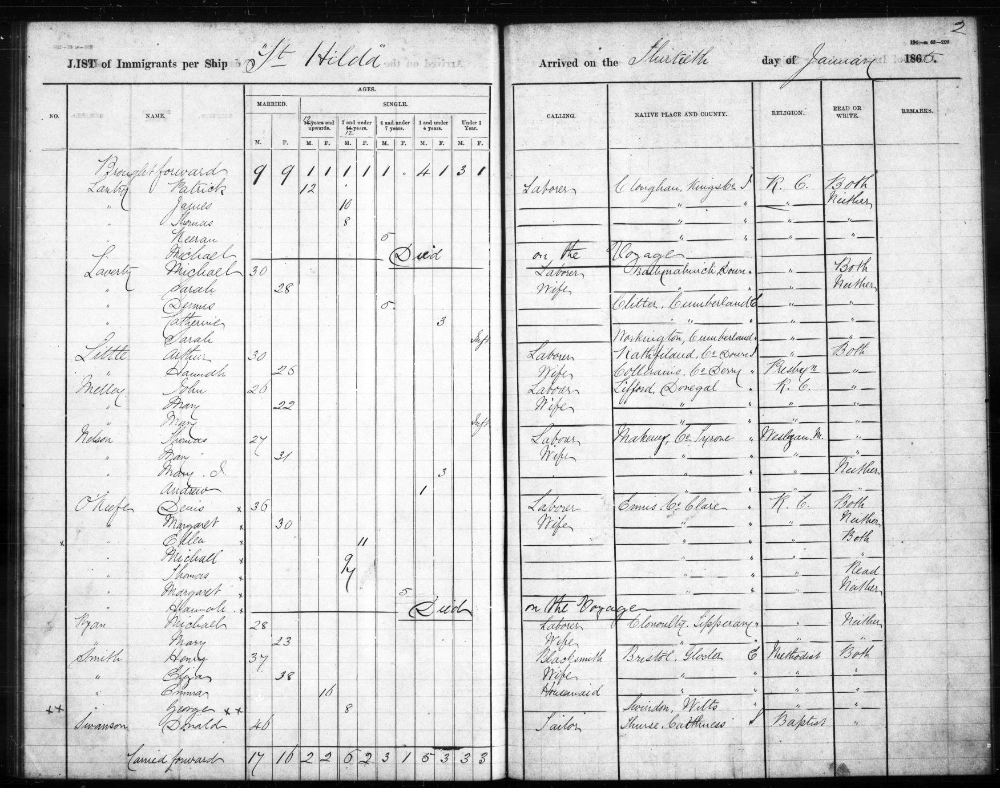

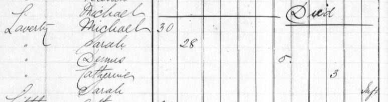

|Surname|Firstname|Age|
|---|---|---|
|Laverty|Michael|30|
|   |Sarah|28|
|   |Dennis|5|
|   |Catherine|3|
|   |Sarah|1|

## Koch Immigration

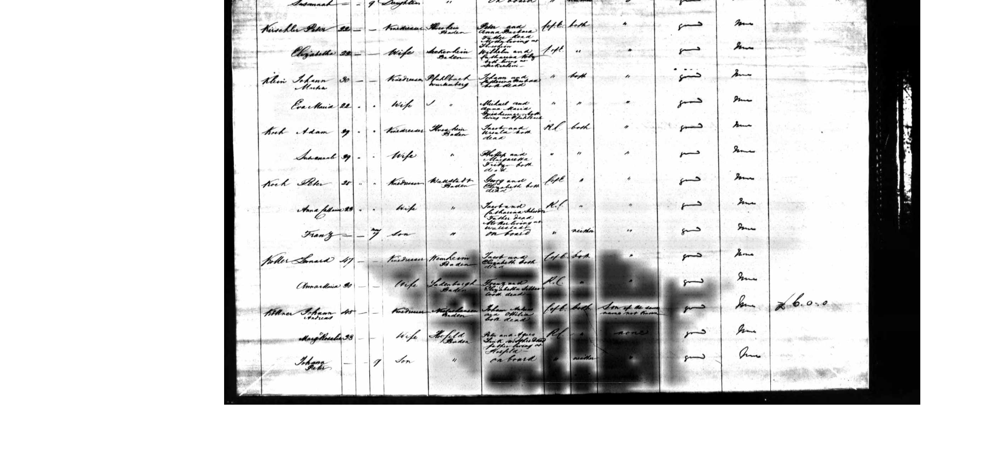

# Births

# Marriages

## Len and Wendy Laverty 1974

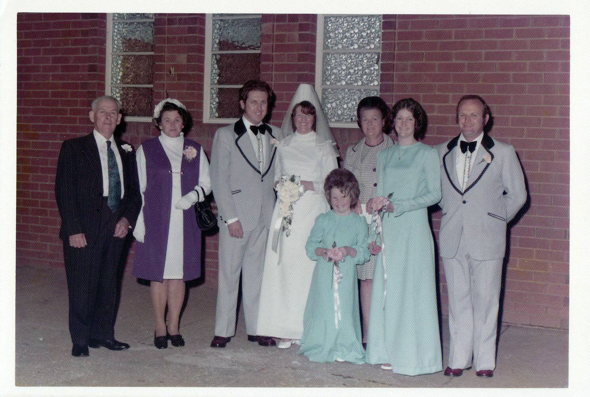

# Deaths

## Elsie Pearl Laverty (McGree) Eulogy

EULOGY
Today as we remember and give thanks for the life of our mother, it is impossible to remember her without mentioning our father also.

Throughout the 54 years of their married life, they were totally committed to each other and their children -they prayed together every night of those 54 years.

This was a tremendous source of grace to them- and to each of their 11 children.

Since the death of my father-four years ago-my mother experienced her own personal brokenness, from which she never really fully recovered.

Like Mary, the mother of Jesus, my mother was a gentle woman of Taith, one who pondered many things in her heart..

In a group, she was generally quiet, reserved and discreet in her conversations.

"She was gifted with tremendous goodness and generosity.She played an important role in the ministry at 211 Dobie St. where for the last eight years she cooked many wonderful cakes, pies and biscuits for the inmates at the correctional centre and their families when they came to visit .On Tuesday, as I thanked her for all she had done, she responded by saying, "I loved doing it"...

Her greatest love was for her family.

Her husband, children, grandchildren and greatgrand children

meant everything to her.

She has left behind her, 11 unfinished masterpieces in her children and I'm sure she would envisage that her children would continue the legacy she and my father instilled in us during their parenting,

Love is patient, love is kind. It is not jealous...It is not rude, it does not seek its own interests-It bears all things, hopes all things, endures all things... Love never fails..

May she rest in peace.

## Leonard James Laverty

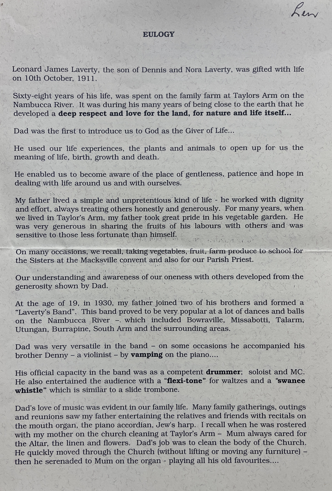

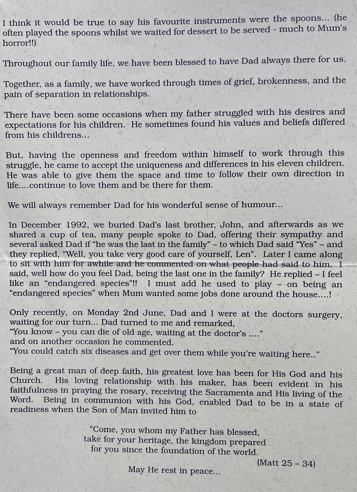

EULOGY
Leonard James Laverty, the son of Dennis and Nora Laverty, was gifted with life on 10th October, 1911.

Sixty-eight years of his life, was spent on the family farm at Taylors Arm on the Nambucca River. It was during his many years of being close to the earth that he developed a deep respect and love for the land, for nature and life itself...

Dad was the first to introduce us to God as the Giver of Life...

He used our life experiences, the plants and animals to open up for us the meaning of life, birth, growth and death.

He enabled us to become aware of the place of gentleness, patience and hope in

dealing with life around us and with ourselves.

My father lived a simple and unpretentious kind of life he worked with dignity and effort, always treating others honestly and generously. For many years, when we lived in Taylor's Arm, my father took great pride in his vegetable garden. He was very generous in sharing the fruits of his labours with others and was sensitive to those less fortunate than himself.

On many occasions, we recall, taking vegetables, fruit, farm produce to school for

the Sisters at the Macksville convent and also for our Parish Priest. Our understanding and awareness of our oneness with others developed from the generosity shown by Dad.

At the age of 19, in 1930, my father joined two of his brothers and formed a "Laverty's Band". This band proved to be very popular at a lot of dances and balls on the Nambucca River which included Bowraville, Missabotti. Talarm,

Utungan, Burrapine, South Arm and the surrounding areas. Dad was very versatile in the band - on some occasions he accompanied his

brother Denny - a violinist - by vamping on the plano....

His official capacity in the band was as a competent drummer; soloist and MC. He also entertained the audience with a "flexi-tone" for waltzes and a "swance whistle" which is similar to a slide trombone.

Dad's love of music was evident in our family life. Many family gatherings, outings and reunions saw my father entertaining the relatives and friends with recitals on the mouth organ, the piano accordian, Jew's harp. I recall when he was rostered with my mother on the church cleaning at Taylor's Arm- Mum always cared for the Altar, the linen and flowers. Dad's job was to clean the body of the Church. He quickly moved through the Church (without lifting or moving any furniture) - then he serenaded to Mum on the organ - playing all his old favourites....

I think it would be true to say his favourite instruments were the spoons... (he often played the spoons whilst we waited for dessert to be served - much to Mum's

horror!!) Throughout our family life, we have been blessed to have Dad always there for us.

Together, as a family, we have worked through times of grief, brokenness, and the

pain of separation in relationships. There have been some occasions when my father struggled with his desires and expectations for his children. He sometimes found his values and beliefs differed

from his childrens...

But, having the openness and freedom within himself to work through this struggle, he came to accept the uniqueness and differences in his eleven children. He was able to give them the space and time to follow their own direction in

life....continue to love them and be there for them. We will always remember Dad for his wonderful sense of humour...

In December 1992, we buried Dad's last brother, John, and afterwards as we shared a cup of tea, many people spoke to Dad, offering their sympathy and several asked Dad if "he was the last in the family" - to which Dad said "Yes" - and they replied. "Well, you take very good care of yourself, Len". Later I came along to sit with him for awhile and he commented on what people had said to him. I said, well how do you feel Dad, being the last one in the family? He replied - I feel like an "endangered species!! I must add he used to play on being an "endangered species" when Mum wanted some jobs done around the house....!

Only recently, on Monday 2nd June, Dad and I were at the doctors surgery. waiting for our turn... Dad turned to and remarked. "You know you can die of old age, waiting at the doctor's ...." and on another occasion he commented. "You could catch six diseases and get over them while you're waiting here.."

Being a great man of deep faith, his greatest love has been for His God and his Church. His loving relationship with his maker, has been evident in his. faithfulness in praying the rosary, receiving the Sacraments and His living of the Word. Being in communion with his God, enabled Dad to be in a state of readiness when the Son of Man invited him to

"Come, you whom my Father has blessed, take for your heritage, the kingdom prepared for you since the foundation of the world.

May He rest in peace...

(Matt 25-34)

## Denis Michael Laverty - Died 26th August, 1961

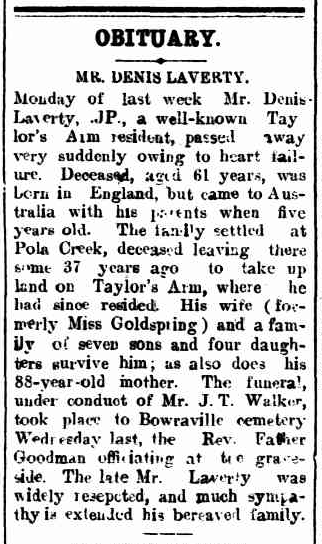

Obituary

Mr Denis Laverty.

Monday of last week Mr. Denis Laverty JP, a well-known Taylor's Arm resident, passed away very suddeling owing to heart failure. Deceased aged 61 years, was born in England, but came to Australia with his parents when five years old. The famiy settled at Pola Creek, deceased leaving there some 37 years ago to take up land on Taylor's Arm, where he had since resided. His wife (formerly Miss Goldspring) and a family of seven sons and four daughters survive him; as also does his 88-year-old mother. The funeral under conduct of Mr. J. T. Walker, took place to Bowraville cemetery Wednesday last, the Rev. Father Goodman officiating at the grace-side. The late Mr. Laverty was widely respected, and much sympathy is extended his bereaved family.

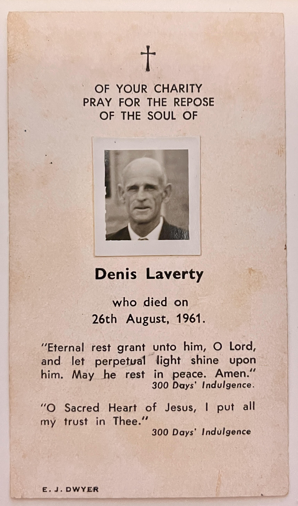

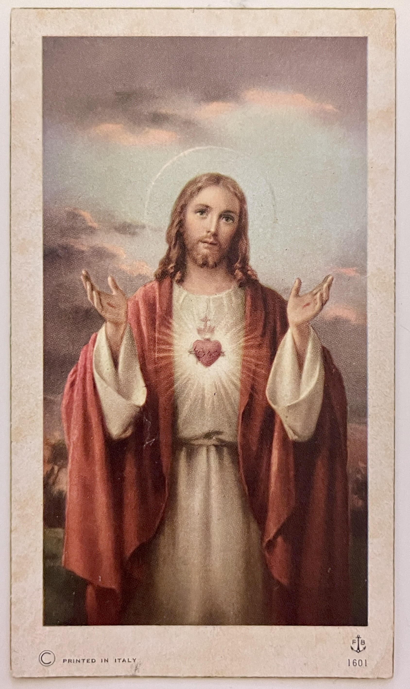

OF YOUR CHARITY PRAY FOR THE REPOSE OF THE SOUL OF

Denis Laverty

who died on

26th August, 1961.

"Eternal rest grant unto him, O Lord, and let perpetual light shine upon him. May he rest in peace. Amen." 300 Days Indulgence.

"O Sacred Heart of Jesus, I put all my trust in Thee."

300 Days' Indulgence

E. J. DWYER

# List of Graves

## Leonard James Laverty and Elsie Pearl Laverty nee McGree

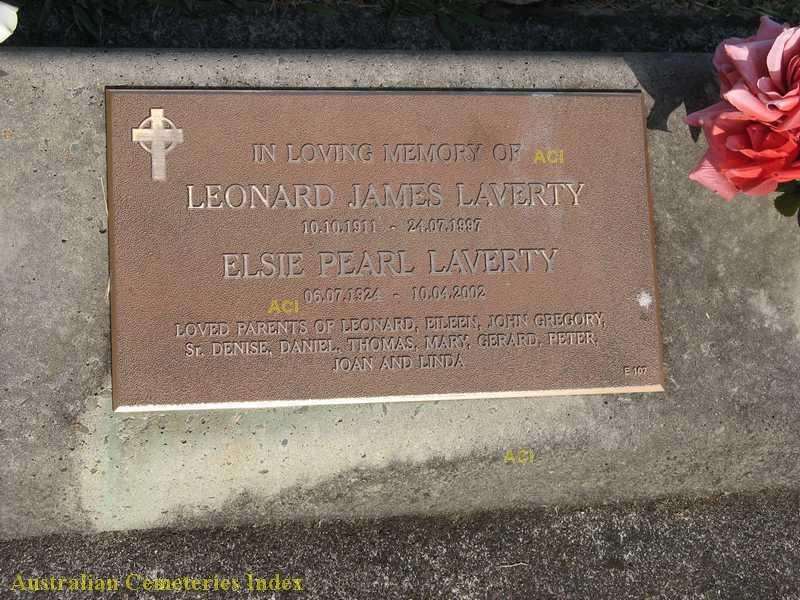

## Denis Laverty 1920 and Nora Laverty nee Goldspring 1944

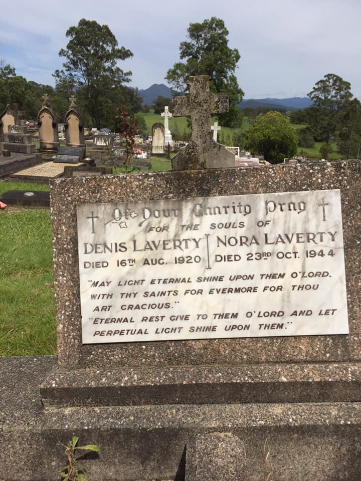

## Peter James McGree

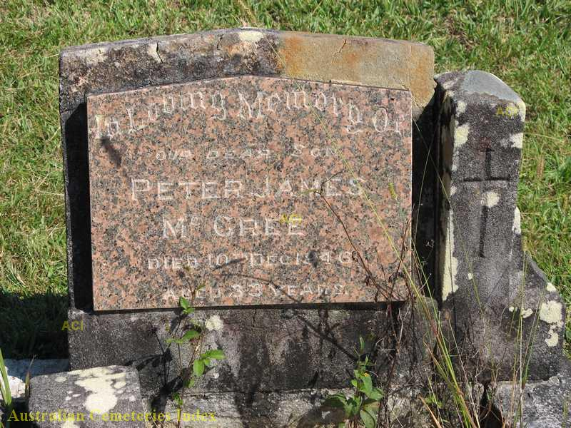

## Ethel Stella Cook (McGree)

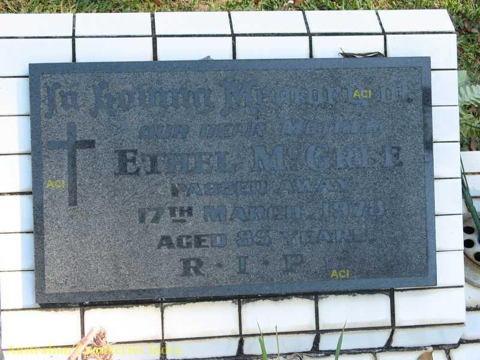

## James & Bridget McGree nee Sullivan

## Alfred Henry Cook and Jessie Elvina Cook nee Coulter

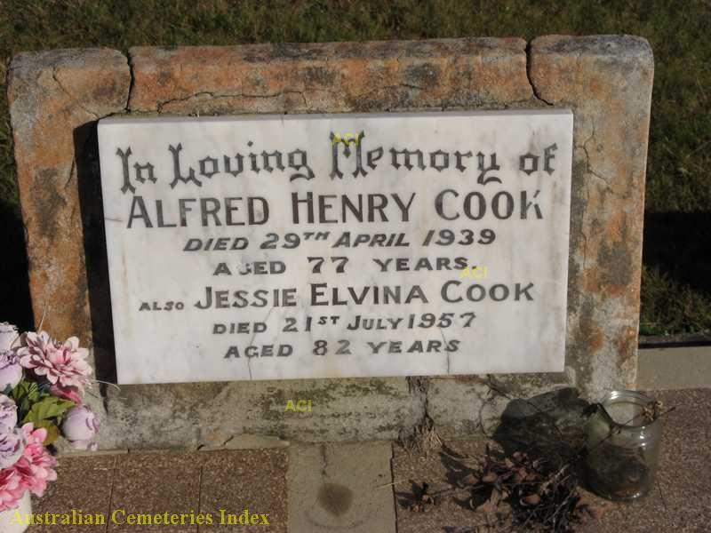

## Michael Laverty and Sarah Jane Laverty nee McCormick

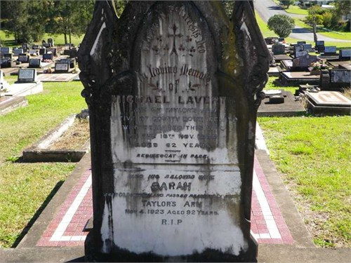